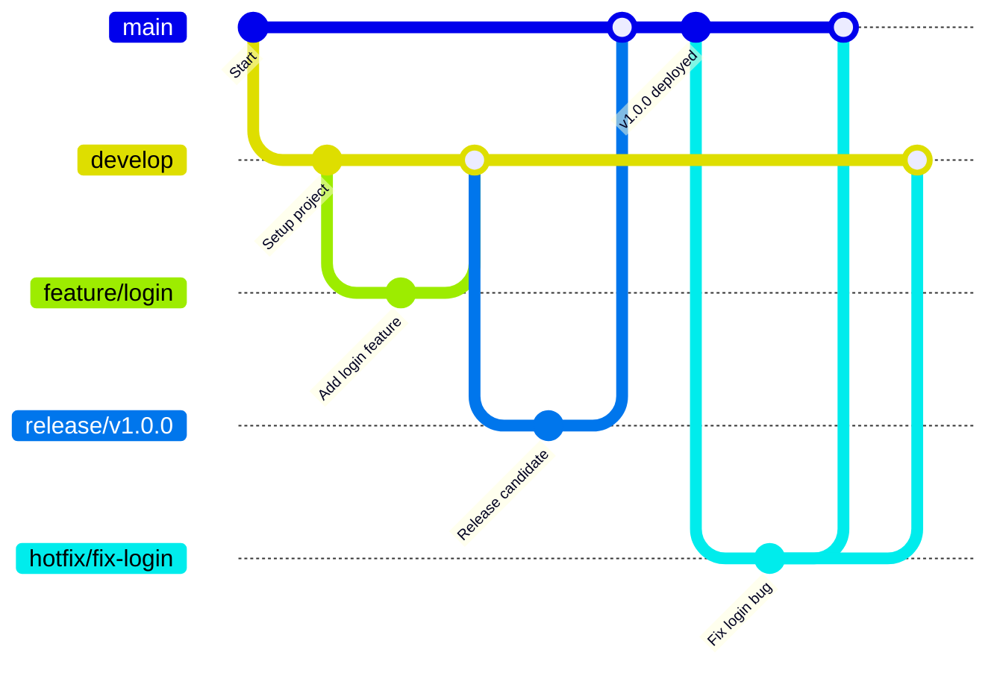
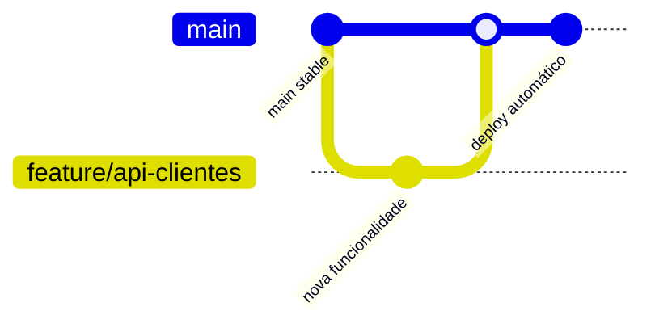
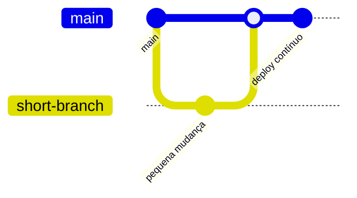

# 🌿 Estrutura de Branches (Git)

A estrutura de **branches** define como o time organiza o desenvolvimento de software em um projeto versionado com **Git**.  
Ela garante **controle de versões, estabilidade em produção e integração contínua (CI/CD)**.

Existem três modelos principais usados atualmente:

1. **Git Flow** — clássico e corporativo  
2. **GitHub Flow** — simples e ágil  
3. **Trunk-Based** — contínuo e moderno  

---

## 🧱 1️⃣ Git Flow (Modelo Corporativo)

O **Git Flow** é ideal para projetos de médio e grande porte, que possuem **releases bem definidas** e ciclos de entrega controlados.

### 🏗️ Estrutura principal

| Branch | Função | Observações |
|--------|--------|-------------|
| **main** | Código de produção | Sempre estável e implantável |
| **develop** | Código em desenvolvimento | Base para novas features |
| **feature/*** | Novas funcionalidades | Criadas a partir de `develop` |
| **release/*** | Preparação para release | Testes e ajustes antes do deploy |
| **hotfix/*** | Correções urgentes em produção | Criadas a partir de `main` |

---

### ⚙️ Fluxo de Trabalho

1. Criar branch `feature/nome-da-feature` a partir de `develop`  
2. Desenvolver e testar  
3. Fazer merge da feature para `develop`  
4. Criar `release/x.y.z` para empacotar a versão  
5. Após testes, mergear `release` em `main` e `develop`  
6. Caso ocorra bug em produção → criar `hotfix/x.y.z` a partir de `main`

---

### 🧩 Exemplo Visual

### ✅ **Vantagens**

- Organização clara entre estágios (desenvolvimento, teste e produção)  
- Permite múltiplas versões em paralelo  
- Excelente para times grandes e sistemas corporativos  

---

### ⚠️ **Desvantagens**

- Complexidade maior de gerenciamento  
- Fluxo mais lento (merge manual e testes longos)  

📍 **Ideal para:** sistemas grandes, corporativos e com processos formais de release.  

---

## ⚡ **2️⃣ GitHub Flow**

O **GitHub Flow** é um modelo mais leve e direto.  
Ele surgiu com o crescimento das **metodologias ágeis** e do **deploy contínuo**, sendo muito usado em **startups** e **microsserviços**.

---

### 🏗️ **Estrutura de Branches**

| Branch | Função |
|--------|--------|
| **main** | Código de produção |
| **feature/*** | Novas funcionalidades |
| **fix/*** | Correções pontuais |
| **test/*** | (Opcional) Validação pré-merge |

---

### ⚙️ **Fluxo de Trabalho**

1. Criar branch `feature/nome-da-feature` a partir de `main`  
2. Desenvolver e testar localmente  
3. Criar um **Pull Request (PR)** para `main`  
4. Revisar, aprovar e fazer merge  
5. CI/CD executa testes e faz o deploy automático  

---

### 🧩 **Exemplo Visual Simplificado**

### ✅ **Vantagens**

- Simples, rápido e eficiente  
- Ideal para deploys frequentes  
- Facilita integração contínua (**CI/CD**)  

---

### ⚠️ **Desvantagens**

- Pouco controle de versões e releases formais  
- Risco de instabilidade se não houver testes automatizados  

---

📍 **Ideal para:**  
Times pequenos e sistemas em **evolução contínua**, como **APIs REST em microsserviços**.

## 🚀 **3️⃣ Trunk-Based Development**

O **Trunk-Based Development** é o modelo mais moderno, adotado por empresas como **Google**, **Netflix** e **Meta**.  
A ideia é **integrar o código constantemente** na branch principal (`main` ou `trunk`), evitando longas ramificações e mantendo o projeto sempre estável.

---

### 🏗️ **Estrutura de Branches**

- **main (trunk):** branch principal, estável e continuamente integrada  
- **short-lived branches:** pequenas branches temporárias, usadas por horas ou poucos dias  

---

### ⚙️ **Fluxo de Trabalho**

1. Desenvolver pequenas mudanças rapidamente  
2. Fazer **merge contínuo** na `main`  
3. Usar **feature toggles (flags)** para ativar/desativar novas funcionalidades  
4. CI/CD roda **testes automatizados** antes de cada merge  

---

### 🧩 **Exemplo Visual**

### ✅ **Vantagens**

- Feedback rápido e integração contínua  
- Menos conflitos de merge  
- Melhor compatibilidade com pipelines automatizados  

---

### ⚠️ **Desvantagens**

- Exige testes automatizados robustos  
- Necessita alta maturidade técnica do time  

---

📍 **Ideal para:**  
Times **DevOps**, pipelines **CI/CD** e projetos com **alta frequência de deploy**.

---

## 🧭 **Comparativo dos Modelos**

| Modelo | Branches principais | Ideal para | Frequência de Deploy | Complexidade |
|---------|--------------------|-------------|----------------------|---------------|
| **Git Flow** | main, develop, feature, release, hotfix | Times médios/grandes | Semanal / Mensal | 🟠 Média/Alta |
| **GitHub Flow** | main, feature, fix | Times pequenos | Diária | 🟢 Baixa |
| **Trunk-Based** | main (única) + short-lived | Times DevOps | Contínuo | 🔴 Alta |

---

## 🧰 **Boas Práticas de Versionamento**

- 🔒 **Proteja a branch `main`** — nunca faça commits diretos  
- 👥 **Use Pull Requests** — para revisão e controle de qualidade  
- ✍️ **Commits pequenos e descritivos** — siga um padrão (ex: *Conventional Commits*)  
- 🧪 **Automatize testes e builds** — com pipelines de **CI/CD**  
- 🏷️ **Utilize tags e releases** — para identificar versões  
- 🔄 **Faça merges frequentes** — evite branches longas e divergentes  

---

## 💬 **Conclusão**

> O **versionamento com Git** é a base da colaboração moderna no desenvolvimento de software.  
> Cada modelo de branching tem um propósito distinto:
>
> - 🧱 **Git Flow** → Controle e estabilidade  
> - ⚡ **GitHub Flow** → Agilidade e simplicidade  
> - 🚀 **Trunk-Based** → Integração e entrega contínua  
>
> O segredo é escolher o modelo que **melhor se encaixa ao tamanho da equipe**, **maturidade do projeto** e **frequência de entrega**.

---

⭐ *“Git não é apenas sobre código — é sobre colaboração, controle e confiança na entrega.”*

    
